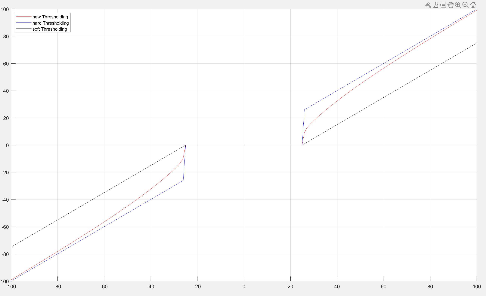
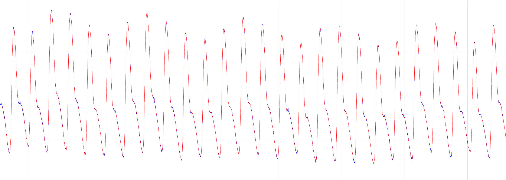
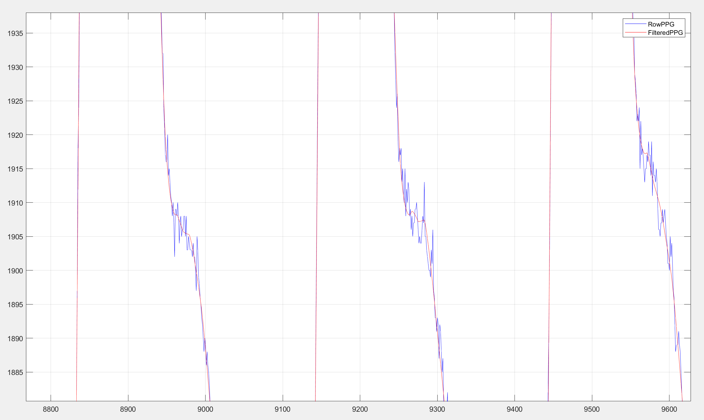
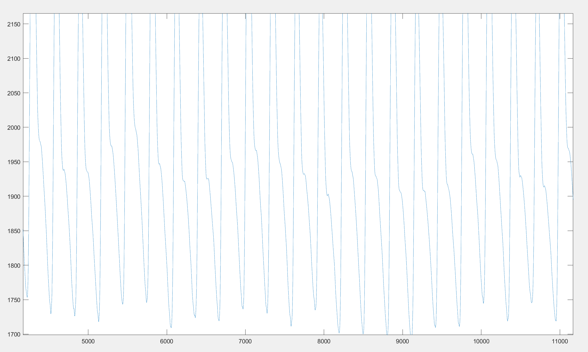

# Reproduction_of_wavelet_denoising_2
Reproduction of paper named An improved wavelet threshold denoising approach for surface electromyography signal

### 1.figure of new thresholding function

### 2.figure of denoising result

## Conclusion

i have changed the sigma function give in the paper, set it simply to a number. This time runs better than the last paper. But as you can see, few noise at the bottom is not completely removed.

## REFERENCE

Ouyang, C., Cai, L., Liu, B., & Zhang, T. (2023). An improved wavelet threshold denoising approach for surface electromyography signal. *EURASIP Journal on Advances in Signal Processing*, *2023*(1). https://doi.org/10.1186/s13634-023-01066-3 
